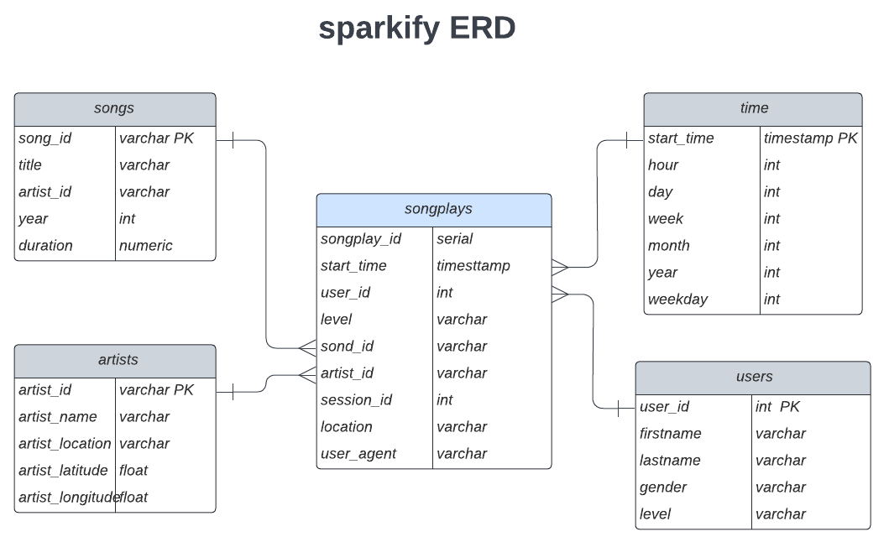

# Project Data Warehouse with AWS Redshift

## Summary
* [Introduction](#Introduction)
* [Data Warehouse Schema Definition](#Data-Warehouse-Schema-Definition)
* [ETL process](#ETL-process)
--------------------------------------------
### Introduction
A startup called Sparkify wants to analyze the data they've been collecting on songs and user activity on their new music streaming application. Sparkify has grown their user base and song database and want to move their processes and data onto the cloud. Their data resides in S3, in a directory of JSON logs on user activity on the application, as well as a directory with JSON metadata on the songs in their application.

They'd like a data engineer to build an ETL pipeline that extracts their data from S3, stages them in Redshift, and transforms data into a set of dimensional tables for their analytics team to continue finding insights in what songs their users are listening to. The role of this project is to create a data warehouse on cloud (AWS Redshift) and build ETL pipeline for this analysis.

In this project we are going to use two Amazon Web Services resources:
* [S3](https://aws.amazon.com/en/s3/)
* [AWS Redshift](https://aws.amazon.com/en/redshift/)

The data sources to ingest into data warehouse are provided by two public S3 buckets:

1. Songs bucket (s3://udacity-dend/song_data), contains info about songs and artists. 
All files are in the same directory.
2. Event bucket (s3://udacity-dend/log_data), contains info about actions done by users, what song are listening, ... 
We have differents directories so we need a descriptor file (also a JSON) in order to extract
data from the folders by path. We used a descriptor file (s3://udacity-dend/log_json_path.json) because we 
don't have a common prefix on folders.

We need to ingest this data into AWS Redshift using COPY command. This command get JSON files
from buckets and copy them into staging tables inside AWS Redshift.

<b>Log Dataset structure:</b>

<b>Song dataset structure:</b>
~~~~
{"num_songs": 1, "artist_id": "ARJIE2Y1187B994AB7", "artist_latitude": null, "artist_longitude": null
, "artist_location": "", "artist_name": "Line Renaud", "song_id": "SOUPIRU12A6D4FA1E1", 
"title": "Der Kleine Dompfaff", "duration": 152.92036, "year": 0}
~~~~
--------------------------------------------
### Data Warehouse Schema Definition

--------------------------------------------
### ETL process
All the transformations logic (ETL) is done in SQL inside Redshift. 

There are 2 main steps:
1. Ingest data from s3 public buckets into staging tables:
2. Insert record into a star schema from staging tables
### steps of project
##### in sql_queries.py have all sql queries we need
##### in config file you have to put all credential of  aws redshift
##### create all tables with create_table.py
##### Insert data into staging tables
##### Insert data into star schema from staging tables with etl.py
